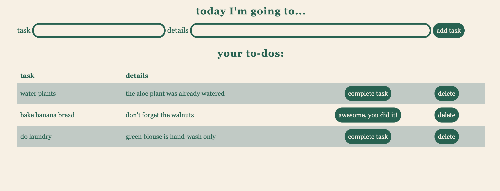

# SQL To Do List

## Description

Duration: weekend sprint

This is a to-do list. A user inputs a task and it's description which is then displayed onto the DOM. A user can delete the task to remove it from the database or complete the task which will update it's status in the database and be reflected onto the DOM. 

## Prerequesites

None

## Usage

1. Enter your task and details into the input field 
2. Delete task's as needed
3. Complete a task to update it's status

## Built With 

Javascript, SQL, JQuery, HTML/CSS

## Acknowledgement

Thanks to Prime Digital Academy who equipped and helped me to make this application a reality. Special thanks to my classmates and my instructor Matt Black.